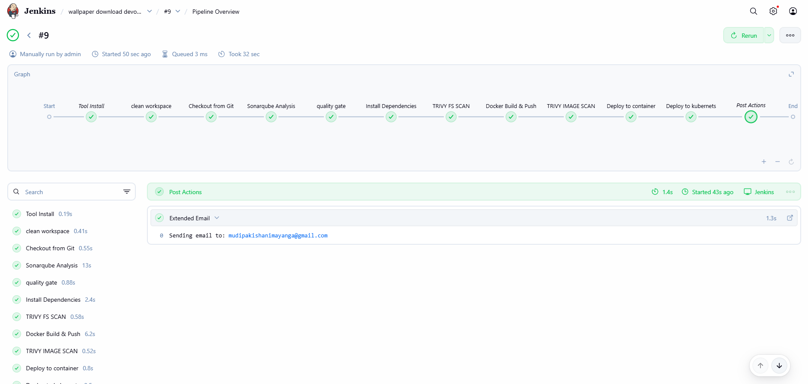
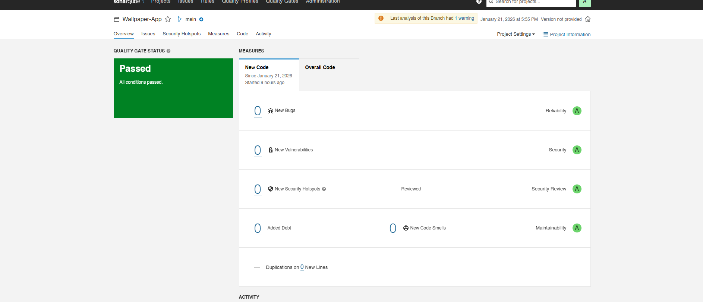
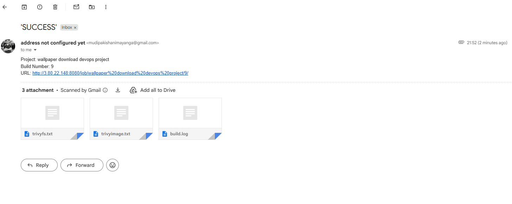
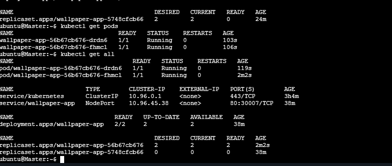
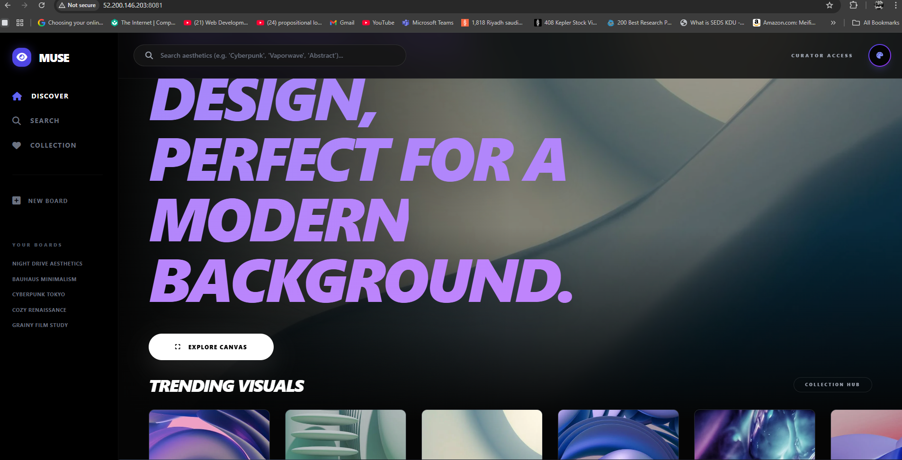
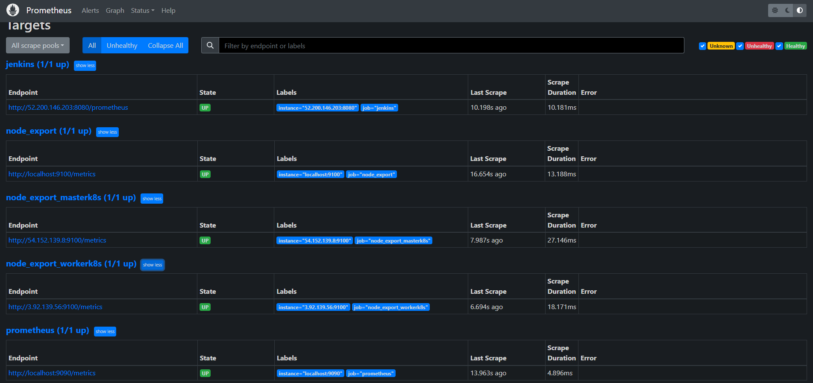
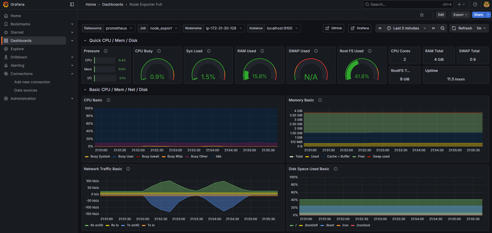
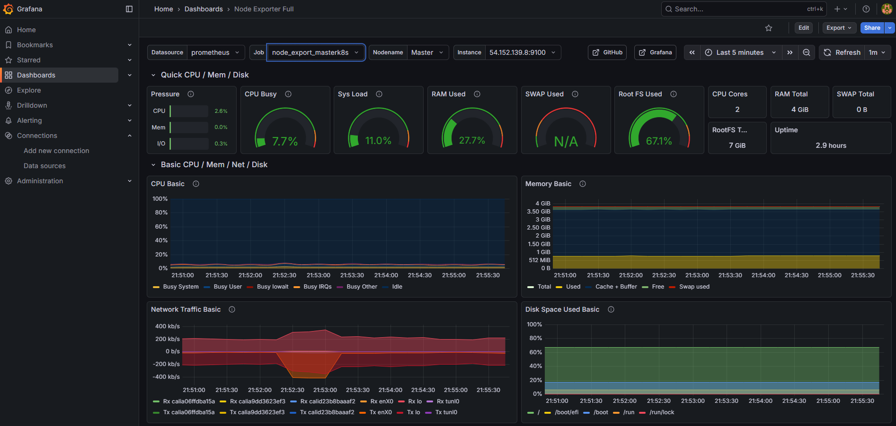
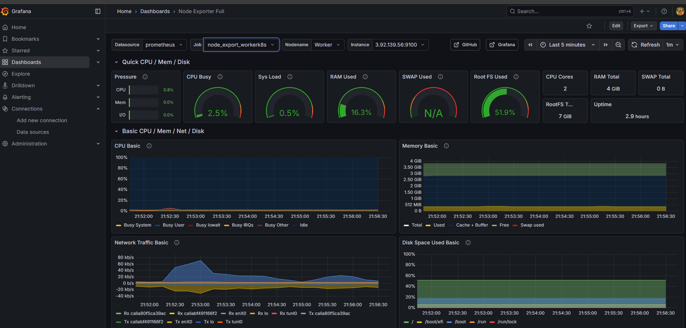

# Wallpaper App: DevSecOps Pipeline Project

This project is a React-based wallpaper discovery application deployed using a full DevSecOps pipeline. The focus of this repository is on the automation, security, and monitoring of a containerized application within a Kubernetes environment.

## Project Overview

The repository contains the source code for a React/Vite application that interacts with the Pexels API. The application is built and deployed automatically through a multi-stage Jenkins pipeline.

## DevSecOps Pipeline

The CI/CD pipeline is orchestrated by Jenkins and includes the following fully automated stages:
1.  **Code Quality**: SonarQube analysis to ensure code standards and catch potential bugs.
2.  **Vulnerability Scanning**: Trivy scans both formatting and the final Docker image for security flaws.
3.  **Containerization**: Docker image build and push to Docker Hub.
4.  **Deployment**: Rolling update deployment to the Kubernetes cluster.
5.  **Notification**: Automated email alerts upon pipeline completion.

### Pipeline Visualization

### Code Quality Analysis (SonarQube)

### Pipeline Notifications

## Infrastructure & Kubernetes Deployment

The application is hosted on AWS EC2 instances serving as a Kubernetes cluster (managed via Kubeadm).
- **Master Node**: Manages the control plane.
- **Worker Node**: Runs the application workloads.
- **Networking**: Calico CNI is used for pod networking.

### Cluster Status
**Running Pods:**

### Application Deployment

**Final Application Live View:**

## Monitoring & Observability

The cluster and application are continuously monitored using a Prometheus and Grafana stack.

### Prometheus Metrics

### Grafana Dashboards
**Node Exporter Metrics:**

**Master Node Health:**

**Worker Node Health:**

## Key Technical Features
- **Infrastructure**: AWS EC2, Kubernetes (Kubeadm)
- **CI/CD**: Jenkins, Docker Hub
- **Security**: Trivy (Container/FS Scanning), SonarQube (Static Analysis)
- **Monitoring**: Prometheus, Grafana, Node Exporter
- **Frontend**: React + Vite
